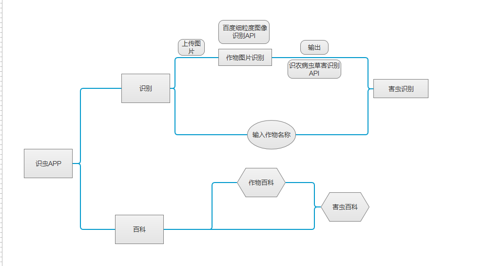
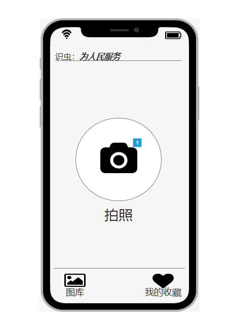
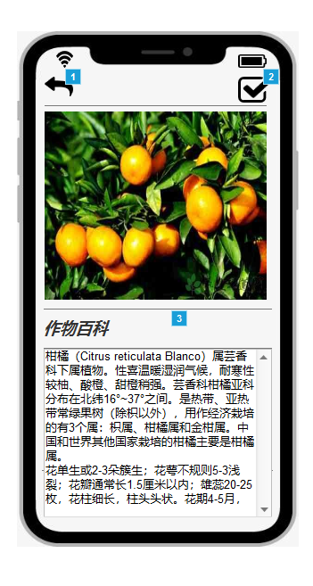
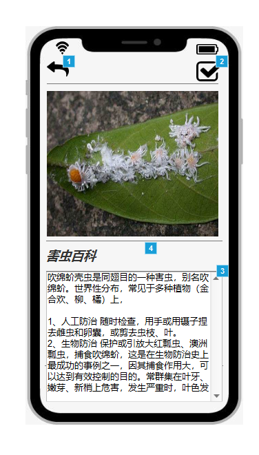
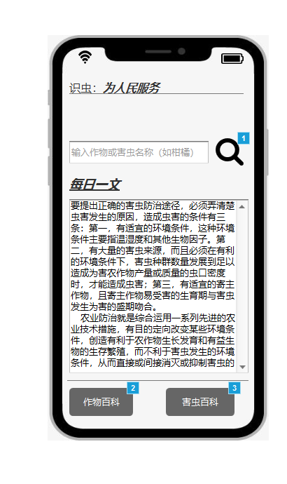
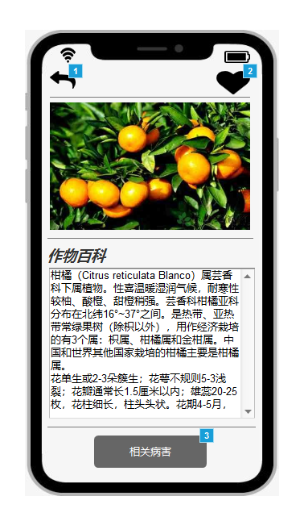
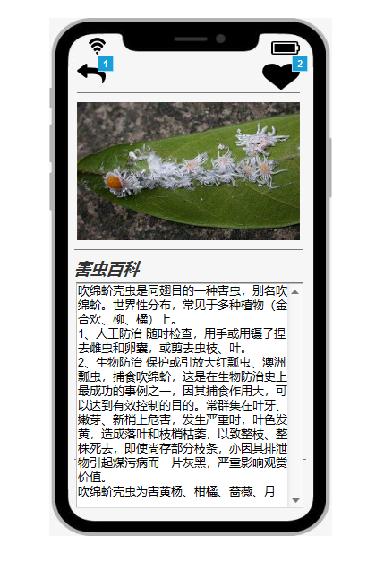
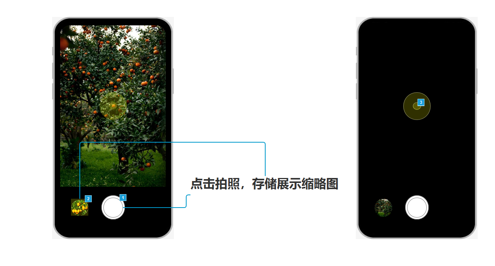
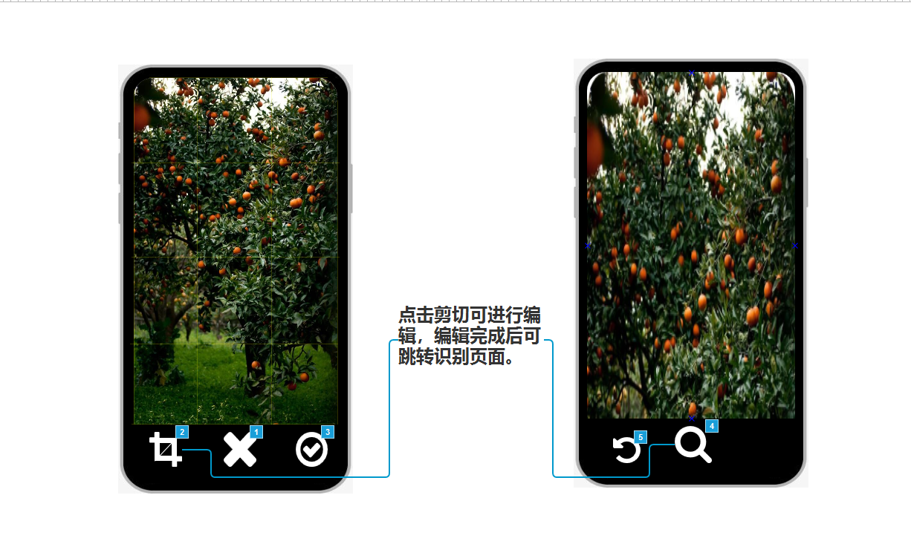
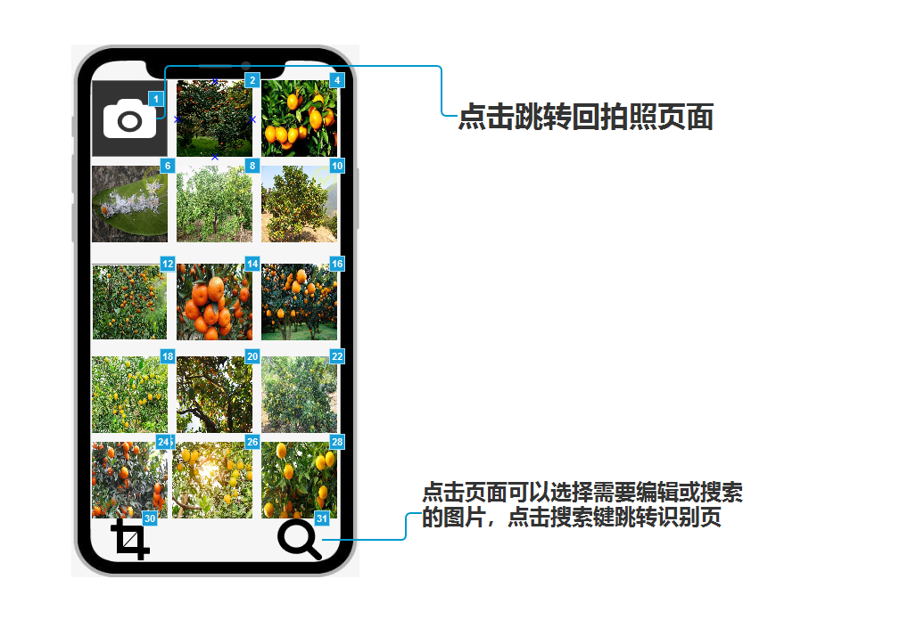

# API_ML_AI PRD

## 识虫
---
| 发布日期 | 2019-12-8  |
| --------   | -----:  |
| 史诗 | 范文 | 
| 文件状态 | 进行中 | 
| 文件主人 | 卢靖民 | 
| 领头设计师  | 卢靖民 | 
| 领头开发者  | 卢靖民 | 
| 领头测试者  | 卢靖民 | 


# 1. 产品说明
## a) 加值宣言
> 为人民服务

识虫是一款识别害虫的小程序，通过识别作物种类获取植物相应害虫信息，用户在认知害虫的同时还能获取作物养殖知识。
## b) 用户痛点

- 用户在遇到虫子不认识或不确认是否遭遇病害虫的时候，识虫app可以及时解决用户的困惑，让其不用在田地之间来回跑。
- 用户身边没有专业人士或专业书籍，获知防治方法渠道少。
## c) 产品核心目标
- 识别图片中的作物，得出作物百科信息。
- 作物害虫信息库能为用户提供合理的指导。

## d) 产品核心价值
作物辨别：最小可行性产品为识别作物种类，检测用户上传作物图片，返回作物养护信息与对应害虫种类。

害虫百科：最小可用产品为识别出害虫种类。

## e) 价值宣言
市场上通常的植物识别大多为城市用户提供养殖花卉知识，缺少对作物与害虫的专业指导，识虫app通过识别作物种类获取植物相应害虫信息，并调取害虫图片进行图片识别，用户在认知害虫的同时还能获取作物养殖知识。

## f) 产品概述(最小可行性产品）
识虫以拍照识别图片中的作物为基础功能，通过对作物进行品类识别，再上传相关害虫照片，对作物害虫信息进行比对分辨

## g) 人工智能概率性
花伴侣智能植物识别API使用中科院权威图库识别数量包括杂草一万一，准确率>95%。

识农病虫草害识别API使用拍照识别，可快速识别作物病虫害以及杂草，并给出相应防治技术，引导种植户进行高效的除草或病虫害防治，准确率高于>90%

# 2. 用户分析
## a) 目标用户群体
- 年龄：18-40岁 
- 学历：小学及以上
- 地区：城市
- 以农业从业人员为主要用户
- 居住在农村、城郊等

## b) 用户需求
|.|功能|应用|技术|
| --- | --- |--- | --- |
|1| 作物识别|作物品类分辨|图像识别
|2|作物百科信息|想进一步了解作物信息，获取作物种植养护资料|图像识别
|4|害虫识别|分辨害虫获取防治信息|图像识别

## c) 使用的API

- [花伴侣智能植物识别API](https://market.aliyun.com/products/57124001/cmapi018620.html?spm=5176.10695662.1996646101.searchclickresult.698566bbXs1Z67#sku=yuncode1262000007)
- [识农病虫草害识别API](https://market.aliyun.com/products/57124001/cmapi00035953.html?spm=5176.730005.productlist.d_cmapi00035953.585735249mZRjj&innerSource=search_植物病虫害#sku=yuncode2995300001)
- [百度细粒度图像识别API](https://cloud.baidu.com/product/imagerecognition/fine_grained)

# 3.可行性分析（使用水平）

**调用花伴侣智能植物识别API**

1.识别清晰的植物图片


```python
import base64
import requests
url_host = "http://plantgw.nongbangzhu.cn"
app_code = '-' #
# 植物花卉识别接口_v2的请求示例
def recognize2():
    url_path = '/plant/recognize2'

    with open("./pics/柑橘.jpg", "rb") as image_file:
        img_base64 = base64.b64encode(image_file.read()).decode('ascii')
        body = {'img_base64': img_base64}

        headers = {'content-type': "application/x-www-form-urlencoded", 'authorization': "APPCODE " + '-'}
        response = requests.request("POST", url_host+url_path, data=body, headers=headers) # 默认utf-8
        print(response.text)

    return
recognize2()
# 植物百科信息获取
def info():
    url_path = '/plant/info'

    code = "gRznEHlcJyg46Tpd" # 这个植物代号是调用recognize2()时获得的InfoCode字段
    body = {'code': code}
    headers = {'content-type': "application/x-www-form-urlencoded", 'authorization': "APPCODE " + app_code}
    response = requests.request("POST", url_host+url_path, data=body, headers=headers) # 默认utf-8
    print(response.text)

    return
info()
```

返回结果
```json
{"log_id": 6350852702531560411, "result": [{"score": 0.9089241027832, 
"name": "柑橘"}, {"score": 0.29999804496765, "name": "橘子"}, {"score": 0.036180101335049, 
"name": "柚子"}, {"score": 0.028431579470634, "name": "桔子"}, {"score": 0.020664585754275, "name": "橙子"}]}
```


**调用百度细粒度图像识别API**

```python
# encoding:utf-8
import base64
import urllib
from urllib.request import urlopen
from urllib.request import Request
from urllib.error import URLError
from urllib.parse import urlencode

'''
植物识别
'''

request_url = "https://aip.baidubce.com/rest/2.0/image-classify/v1/plant"


f = open('./pics/柑橘.jpeg', 'rb')
img = base64.b64encode(f.read()).decode('ascii')

params = {"image":img}
params = urlencode(params).encode("utf-8")

access_token = '-'
request_url = request_url + "?access_token=" + access_token
request = Request(url=request_url, data=params)
request.add_header('Content-Type', 'application/x-www-form-urlencoded')
response = urlopen(request)
content = response.read()
content=content.decode('utf-8')
if content:
    print (content)
```

返回结果

```json
{"log_id": 6350852702531560411, "result": [{"score": 0.9089241027832, 
"name": "柑橘"}, {"score": 0.29999804496765, "name": "橘子"}
```

## API使用比较分析
对比花伴侣智能植物识别API和百度细粒度识别API，很明显百度细粒度图像识别结果较为正确，图片中的柑橘因为与类别相近的橙子等相似，可以在一定程度上衡量两家图片识别api之间的水平。

# 4.API使用风险评估
#### 吹绵蚧（柑橘害虫）


**识农病虫草害识别API**
```python
import urllib, urllib2, sys
import ssl


host = 'https://senseagro.market.alicloudapi.com'
path = '/api/senseApi'
method = 'POST'
appcode = 'sdaaeaf'
querys = ''
bodys = {}
url = host + path

bodys['crop_id'] = '''1'''
bodys['image_url'] = '''http://seopic.699pic.com/photo/50050/6130.jpg_wh1200.jpg'''
post_data = urllib.urlencode(bodys)
request = urllib2.Request(url, post_data)
request.add_header('Authorization', 'APPCODE ' + appcode)
//根据API的要求，定义相对应的Content-Type
request.add_header('Content-Type', 'application/x-www-form-urlencoded; charset=UTF-8')
ctx = ssl.create_default_context()
ctx.check_hostname = False
ctx.verify_mode = ssl.CERT_NONE
response = urllib2.urlopen(request, context=ctx)
content = response.read()
if (content):
    print(content)
```
输出结果
```json

{
  "status": "1",
  "msg": "操作成功",
  "content": {
    "result": "蚧虫",
    "score": 98.85
  }
}
```
#### 风险报告
识农病虫草害识别API 识别结果能得出作物是否患病，但对详细虫类识别仍然较弱，并不能区分出柑橘蚧虫之间的分别，需要农户再对柑橘蚧虫种类进行人工区分，遇到难以区分的虫类可能会对用户造成困惑。这类识别API由于设计深度学习，难度较大，未来发展前景明朗，但鉴于目前关于识别病害虫的api罕有提供商，可以考虑在出现新的识别害虫API出现后改换或后期自行研发。

---

# 5.产品原型
[产品原型](http://nfunm061.gitee.io/api_mall_ai_final/#g=1&p=害虫识别)
1.产品结构图


## 产品原型介绍


此页为进入app后出现的页面，在页面中可以打开相机功能拍摄相关作物害虫图片，也可以直接跳转至百科页面搜索。也可以点击我的收藏页面继续查看收藏内容。


在拍摄或调取图像进行识别时跳转此页面，可以在此页面进行进一步的图像处理或跳转回拍摄界面。



在经过图像识别反馈后跳转此页面，在此页面中可以识别出作物种类并调用作物百科内容辅助用户进行判断，也可跳转至作物百科页获取更多详细内容。（此项使用花伴侣智能植物识别API和百度细粒度识别API进行类比识别）



在作物识别后再调取相应害虫识别模块进行识别，在此页面中可以分辨出害虫种类并调取害虫百科帮助用户进行下一步防治工作。（此项使用识农病虫草害识别API和百度细粒度识别API进行类比识别）



此页面提供百科内容搜索，为用户详细了解相关知识提供简便的渠道，并在搜索框下方添加一篇每日更新的农业相关文章，让用户积累相应知识。



此页面在百科首页搜索跳转和作物识别后跳转而来。



此页面在百科首页搜索跳转和害虫识别后跳转而来，为用户下一步专业防治工作提供部分帮助。








